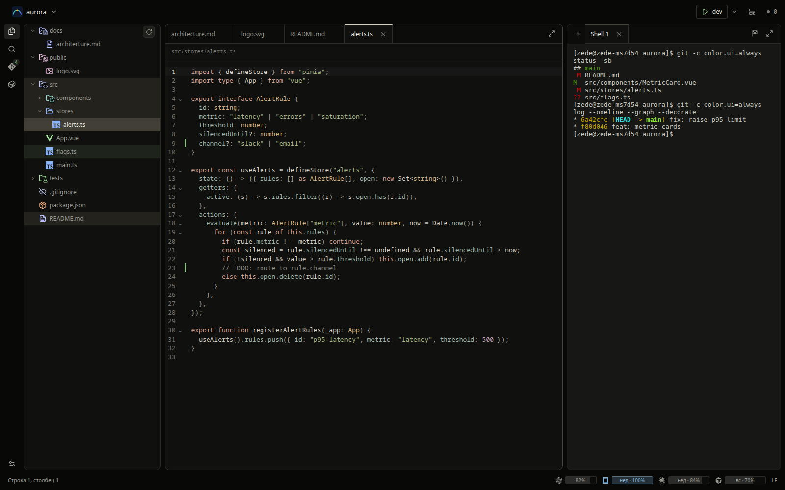
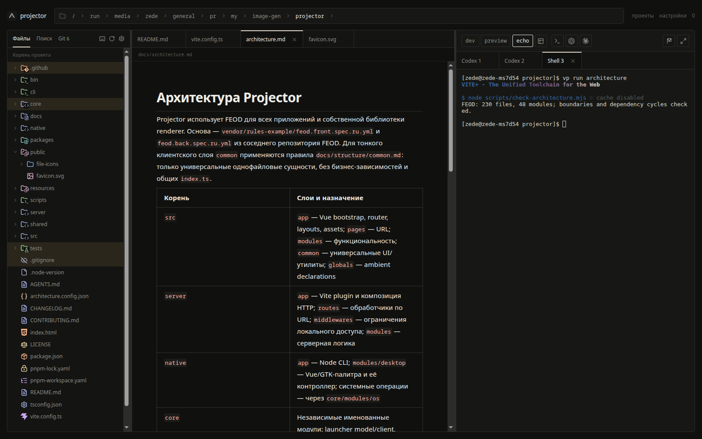
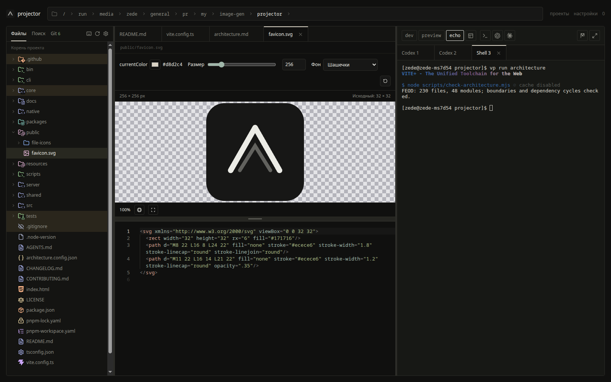
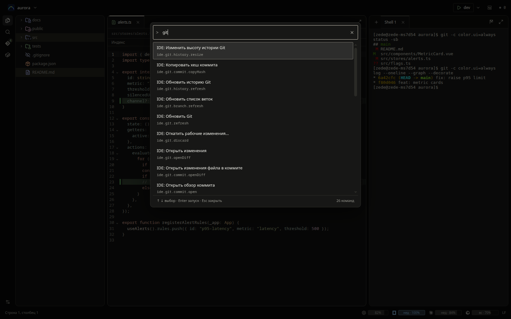

# Projector

Projector — локальное приложение для Linux, которое помогает запускать приложения и работать со своими проектами. В одном окне доступны файлы, поиск, Git, редактор Markdown и терминалы. Можно открыть обычный shell или запустить установленные Codex, Claude Code, OpenCode и Cursor.

> Warning! Это личный проект который делается для себя и только под себя. Решаю личные боли и заменяю инструменты которыми мне неудобно пользоваться. Если решитесь поставить, то только на свой страх и риск

<br />

> Info! Это не IDE в привычном виде, это между IDE и ADE, где внимание сосредоточено на просмотре и чтении, а не редактировании кода или оркестрации агентами, а также крайне простой запуск и поддержка проектов без лишней возни и настроек (в процессе)

## Интерфейс



На скриншотах Projector открыт в самом Projector: слева дерево проекта,
в центре файл, справа терминалы и команды запуска.

<details>
<summary>Markdown, SVG и палитра команд</summary>

**Markdown.** Документация отображается как редактируемый документ с таблицами
и форматированием; Ctrl+Shift+M переключает документ и исходник.



**SVG.** Предпросмотр и исходник в одной вкладке, с настройками цвета, размера,
фона и масштаба.



**Палитра команд.** Ctrl+Shift+P или F1 открывает поиск действий по текущему
контексту с подсказками горячих клавиш.



</details>

## Установка

Projector пока устанавливается из исходников. Проверенное окружение — KDE Plasma с X11.

Перед установкой понадобятся:

- Node.js 24 и [Vite+](https://viteplus.dev/) с командой `vp` в `PATH`.
- GTK4 и GObject Introspection, включая typelib GioUnix.
- Python 3, `make` и компилятор C++ для сборки зависимостей.
- `git`, `rg` (ripgrep) и GNU `mv` для работы с проектами.
- `xdg-open` для открытия браузера; для режима отдельного веб-окна — Chromium, `xdotool` и `xprop`.

Скачайте выпуск и установите зависимости:

```bash
git clone --branch v0.3.3 https://github.com/Sdju/projector.git
cd projector
vp install --frozen-lockfile
vp run build
./bin/projector
```

Исходники также доступны в [GitHub Releases](https://github.com/Sdju/projector/releases).
Сборка проверяет код и создаёт веб-ресурсы; запуск пока использует `vp dev`
из этой папки. Отдельного бинарного установщика в версии 0.3.3 нет.

Откроется окно поиска приложений и проектов. Чтобы использовать Projector в обычном браузере:

```bash
./bin/projector --browser
```

На Windows системное GTK-окно недоступно. Веб-интерфейс запускается так:

```bat
bin\projector.cmd --browser
```

Веб-интерфейс доступен по адресу <http://localhost:4177> при работающем Projector.

Чтобы добавить Projector в меню приложений и установить команду `projector`:

```bash
vp run desktop
```

Команда устанавливается в `~/.local/bin`; эта папка должна быть в `PATH`. Сохраняйте папку с исходниками на прежнем месте: установка ссылается на неё. После переноса повторите `vp run desktop`.

## Первые шаги

1. Введите название приложения или проекта в поиске и нажмите Enter.
2. Откройте «Проекты», добавьте папку своего проекта и нажмите «Прочитать», чтобы загрузить имя и команды из `package.json`.
3. Откройте проект: слева находятся файлы, поиск и Git, справа — терминалы. Команды вроде `dev` и `preview` запускаются из панели проекта.
4. Откройте Markdown-файл для редактирования. Изменения сохраняются по Ctrl+S и при потере фокуса. Ctrl+Shift+M переключает документ и исходник.

В «Настройках» можно выбрать режим окна и сочетание клавиш. В KDE по умолчанию Ctrl+Alt+Space показывает и скрывает поиск; в других окружениях назначьте сочетание на команду `projector toggle`.

Для терминалов Codex, Claude Code, OpenCode и Cursor соответствующие CLI должны быть заранее установлены и авторизованы (`agent login` для Cursor).

## Запуск и завершение

После установки команды доступны:

```bash
projector toggle     # показать или скрыть поиск
projector --browser  # открыть в браузере
projector --tray     # запустить в трее без окна поиска
projector quit       # завершить Projector и запущенные им процессы
```

Для автозапуска добавьте `projector --tray` в настройки автозапуска рабочего окружения. Esc скрывает поиск; выход и перезапуск Projector завершают его терминальные сессии и процессы.

Настройки и список проектов сохраняются в `~/.local/share/projector` или `$XDG_DATA_HOME/projector`, если эта переменная задана.

Подробнее: [использование](docs/usage.md) и [подключение GitHub](docs/integrations.md). Инструкции для разработки находятся в [AGENTS.md](AGENTS.md).

## Разработка и лицензия

[Правила участия](CONTRIBUTING.md), [изменения в выпусках](CHANGELOG.md).
Projector распространяется по лицензии [MIT](LICENSE). Лицензии включённых
иконок приведены в [NOTICE](public/file-icons/NOTICE.md); пакет `vio` содержит
свой [LICENSE](packages/vio/LICENSE).
